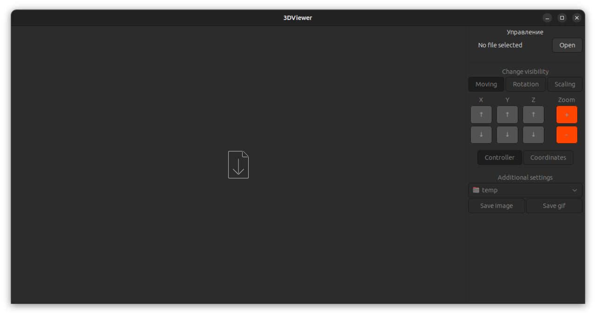
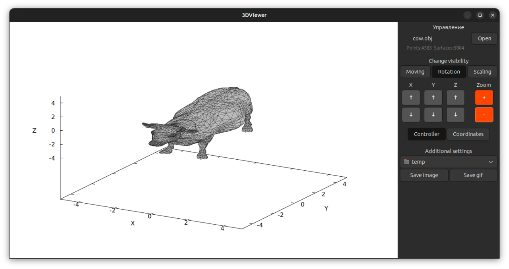
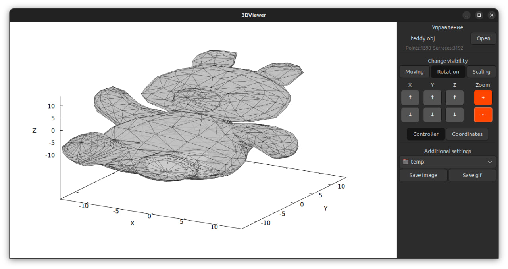

# 3DViewer

Программа 3DViewer позволяет визуализировать каркасную модель объектов в трехмерном пространстве. Ввод моделей происходит посредством загрузки *.obj файлов (формат файла описания геометрии, впервые разработанный компанией Wavefront Technologies. Формат файла открыт и принят многими поставщиками приложений для 3D-графики).

С моделями можно проводить следующие операции:
- Перемещать модель на заданное расстояние относительно осей X, Y, Z.
- Поворачивать модель на заданный угол относительно своих осей X, Y, Z
- Масштабировать модель на заданное значение относительно осей X, Y, Z
- Сохранять изображения
- Записывать gif заданной длительности

Интерфейс программы реализован при помощи фреймворка GTK+ (v3.0).

## Интерфейс программы

